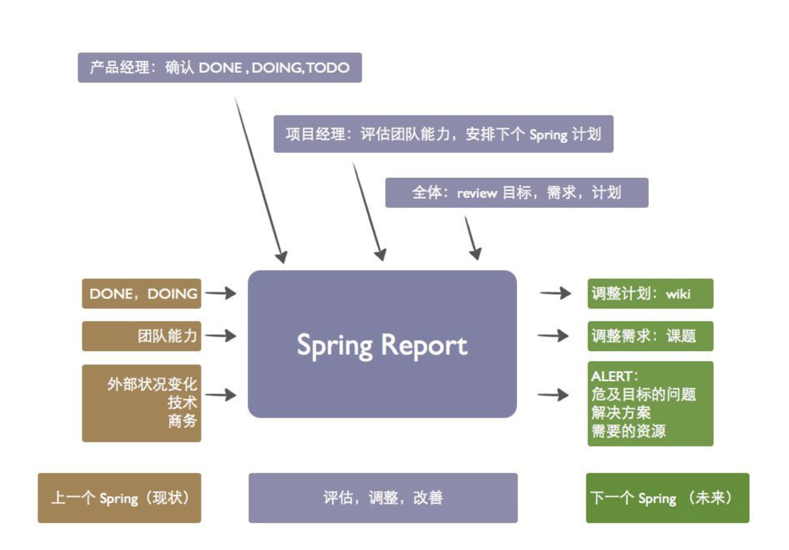

# 团队管理效率、领导力

### 1. 明确的架构

> 谁在什么位置，负责什么内容

### 2. 明确的目标

> 领导是决定把梯子搭在哪个墙上的人

### 3. 没有权力，没有责任

> 为下属解决他们解决不了的问题

### 4. 可视化

> 团队大了最大的问题是你看不到问题，信息对称

### 5. 扁平化

> 任何一件事的负责人，都可以直接找到可以拍板的人

### 6. 分割和适当的中间结果检查

> 把大项目分割成多个时间点做检查可以有效的管理风险

​	可以考虑借鉴敏捷开发方式。

### 7. 提前要求承诺

> 提前以项目的方式要求团队成员承诺

### 8. 不要试图改变一个人

> 把他换到更合适的地方去，“有潜力”、“慢慢提高”很多时候是一厢情愿

### 9. 要结果，不要借口

### 10. 不断改善

### 参考资料

1. [团队管理效率、领导力，真的能后天提高吗？](https://www.zhihu.com/question/21019164/answer/16916794)